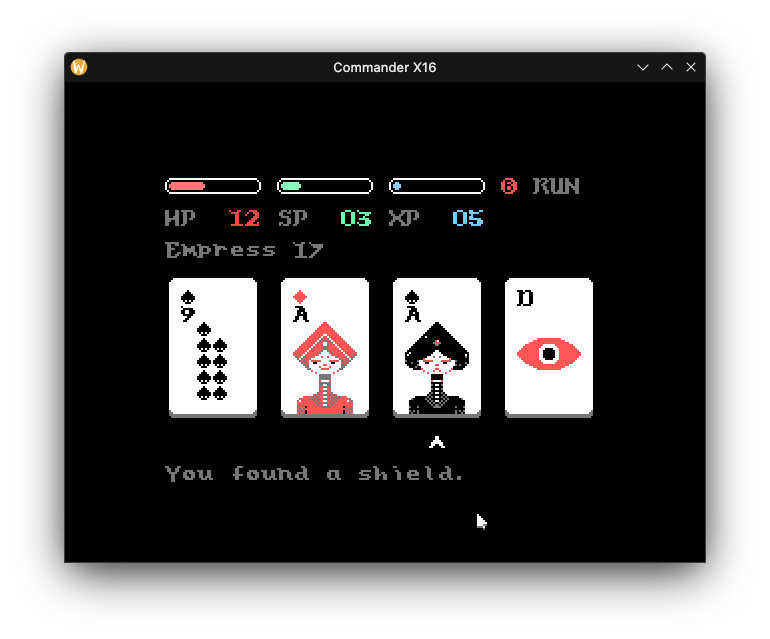

<!--
SPDX-FileCopyrightText: 2023 Janet Blackquill <uhhadd@gmail.com>

SPDX-License-Identifier: CC0-1.0
-->

# Donsol X16

Donsol (short for dungeon solitaire) is a solitary dungeon crawler played with a deck of 54 cards.
Each room has you drawing four cards; hearts are health potions, diamonds are shields, clubs and spades are monsters.
Your aim is to use potions, shields, and combat wisely to get through the entire dungeon of 54 cards.

The game is a port of the NES & UXN implementations by Hundredrabbits; which can be found [on their sourcehut](https://git.sr.ht/~rabbits/donsol).
Their site explains more about the game, which [can be found here](https://100r.co/site/donsol.html#screenshots).

If you like Donsol, consider buying the versions by Hundredrabbits from their [Itch storefront](https://hundredrabbits.itch.io/donsol); it comes with ROMs for many other systems as well as cartridge art and a printable instruction booklet.
